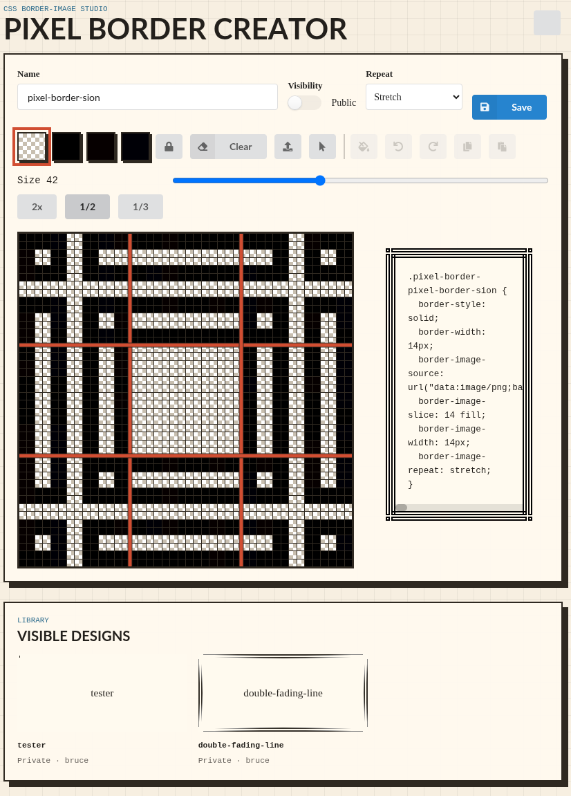

# Pixel Border Creator

## Purpose

Pixel Border Creator is a Django web app for designing 9-patch style CSS `border-image` PNGs. It provides a reusable Django app named `pixelborders`, backed by Django auth and SQLite for local development.

Inspired by and thanks to [Broider by Max Bittker](https://maxbittker.github.io/broider/).

## License

Copyright (C) 2026, Bruce Kroeze

This program is free software: you can redistribute it and/or modify
it under the terms of the GNU General Public License as published by
the Free Software Foundation, either version 3 of the License, or
(at your option) any later version.

This program is distributed in the hope that it will be useful,
but WITHOUT ANY WARRANTY; without even the implied warranty of
MERCHANTABILITY or FITNESS FOR A PARTICULAR PURPOSE.  See the
GNU General Public License for more details.

You should have received a copy of the GNU General Public License
along with this program.  If not, see <https://www.gnu.org/licenses/>.

## Screenshot

## Setup

From the repository root:

    python3 -m venv .venv
    . .venv/bin/activate
    pip install -e .
    python manage.py migrate
    python manage.py createsuperuser
    python manage.py runserver 127.0.0.1:8000

Open `http://127.0.0.1:8000/`, sign in, paint the grid, save a design, and click the CSS preview to copy the generated CSS.

## Tests

Run:

    . .venv/bin/activate
    python manage.py test
